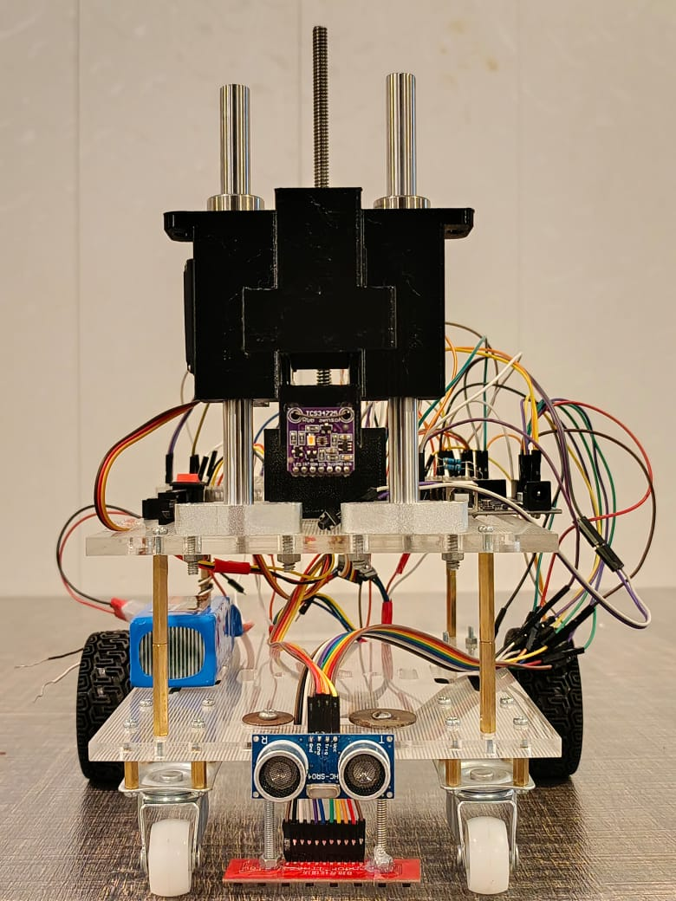
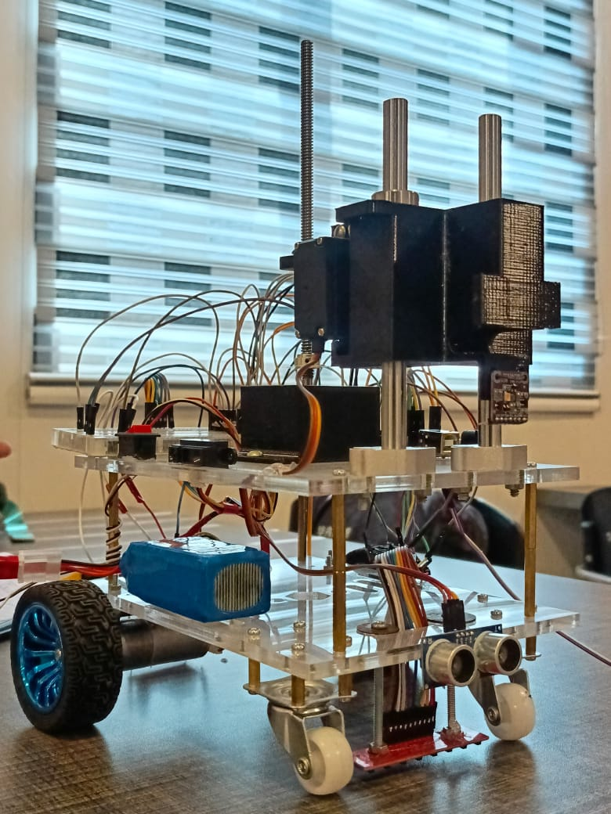

# Autonomous Mobile Robot with Pallet Placement System

## 📋 Project Overview

This project is a complete autonomous robot system designed for precision navigation and material handling. The robot navigates a 4×4 grid using an 8-channel QTR sensor array, detects intersections, and executes complex maneuvers including turning, obstacle detection, and automated pallet placement.

Developed for National Engineering and Robotics Contest (NERC) in 2026, this robot demonstrates:
- Autonomous navigation on grid-based paths
- Precision obstacle detection and avoidance
- Automated pallet placement using color sensing


### 🎯 Key Capabilities

- **Autonomous Navigation:** PID-controlled line following with intersection detection
- **Grid Navigation:** Navigates through intersections with specific turn logic
- **Obstacle Detection:** Ultrasonic sensor for rack detection and collision avoidance
- **Pallet Mechanism:** Servo-controlled pushing/retracting with stepper elevator
- **Color Detection:** TCS34725 sensor for blue color identification during pallet placement
- **State Management:** Multi-phase operation with graceful transitions

## Robot Photos
| Front View | Side View | 
|------------|-----------|
|  |  |

### 🏗️ System Architecture
Phase 1: Grid Navigation 
Navigates the arena autonomously.

Phase 2: Rack Approach
└── Ultrasonic distance monitoring (stops at 1cm)

Phase 3: Pallet Placement
├── Elevator up while scanning for blue color
├── One full rotation after detection
├── Servo pushes pallet (CW)
├── Servo retracts (CCW)
└── Elevator lowers (5500 steps)


### 🔧 Hardware Components

| Component | Purpose | Quantity |
|-----------|---------|----------|
| Arduino Mega | Main controller | 1 |
| TB6612FNG | DC motor control | 1 |
| 2x DC Motors | Differential drive | 2 |
| 8-Channel QTR Array | Line sensing | 1 |
| HC-SR04 | Ultrasonic obstacle detection | 1 |
| TCS34725 | Color sensing (blue detection) | 1 |
| NEMA 11 | Elevator mechanism | 1 |
| MG996R | Pallet push/retract | 1 |
| Push Buttons (x2) | Calibration & Start | 2 |


### 📦 Required Libraries
```cpp
// Install these libraries from Arduino Library Manager or GitHub
#include <QTRSensors.h>          // Pololu QTR Sensors
#include <SparkFun_TB6612.h>    // TB6612 Motor Driver
#include <Wire.h>               // I2C Communication
#include <Adafruit_TCS34725.h>  // Color Sensor
#include <Servo.h>              // Servo Control

🚀 Getting Started
1. Wiring
Connect components according to the pin configuration in the code:

| Component | Pin(s) |
|-----------|--------|
| TB6612 - AIN1 | 3 |
| TB6612 - AIN2 | 4 |
| TB6612 - PWMA | 5 |
| TB6612 - BIN1 | 7 |
| TB6612 - BIN2 | 8 |
| TB6612 - PWMB | 6 |
| TB6612 - STBY | 9 |
| Ultrasonic TRIG | 18 |
| Ultrasonic ECHO | 19 |
| A4988 STEP | 13 |
| A4988 DIR | 12 |
| Servo | 44 |
| Calibrate Button | 11 |
| Start Button | 10 |
| QTR Sensors | A0-A7 |
| TCS34725 | I2C (SDA/SCL) |
| LED_BUILTIN | 13 |

2. Calibration
Place robot on the line track

Press the calibrate button (Pin 11)

Move robot back and forth over the line during calibration

Wait for LED to stop flashing

3. Running
Press the start button (Pin 10)

Robot will begin autonomous navigation

Monitor Serial Monitor for debug output (9600 baud)

📊 Performance Results

✅ 10/10 successful runs

✅ Consistent intersection detection

✅ ±1cm stopping accuracy from obstacle

✅ Consistent blue color detection and pallet placement

✅ Average completion time: 41 seconds
